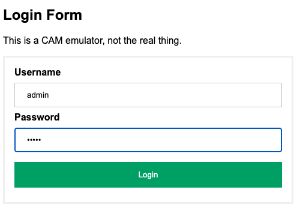

<!--
Copyright (c) 2023 The Johns Hopkins University Applied Physics
Laboratory LLC.

This file is part of the Asynchronous Network Managment System (ANMS).

Licensed under the Apache License, Version 2.0 (the "License");
you may not use this file except in compliance with the License.
You may obtain a copy of the License at
    http://www.apache.org/licenses/LICENSE-2.0
Unless required by applicable law or agreed to in writing, software
distributed under the License is distributed on an "AS IS" BASIS,
WITHOUT WARRANTIES OR CONDITIONS OF ANY KIND, either express or implied.
See the License for the specific language governing permissions and
limitations under the License.

This work was performed for the Jet Propulsion Laboratory, California
Institute of Technology, sponsored by the United States Government under
the prime contract 80NM0018D0004 between the Caltech and NASA under
subcontract 1658085.
-->
#  AMMOS ANMS

This is a detailed developer-focused documentation for the AMMOS Asynchronous Network Management System (ANMS).

### Copyright

Copyright (C) 2022-2023 The Johns Hopkins University Applied Physics Laboratory LLC.

[[_TOC_]]

# Quick Start

This section details prerequisites to installing the ANMS from source on a development system and gives a brief explanation of the container configuration.

## Dependencies

### Software and OS Versions

The setup of ANMS and demos listed in this README have been tested on macOS 11.6.4 (Big Sur) and Ubuntu 20.04.
To run the ANMS tool, you must also install Docker Engine version 20.10.10 or newer, and Docker Compose version 1.29.2 or newer. 

The ANMS UI capability has been tested on Firefox version 96.0.1.
There is no capability that should preclude operation on other modern browsers. 

### Network Setup

If your computer is behind a network proxy, this may cause issues related to using self-signed certificates when pulling dependencies to build Docker images.
Though ANMS can be run behind a proxy; building the ANMS Docker images from behind a network proxy may result in errors.

The first steps in each of the container image `Dockerfile` is to attempt to download an APLNIS root CA to validate the APLNIS HTTPS proxy.
When building images outside of the APLNIS, this download will gracefully fail and the image will not be able to run within the APLNIS.

### Upgrading ANMS

If upgrading from an earlier version, a few steps are necessary to clear out earlier state.
The following command sequence uses standard Docker commands to stop all containers and remove all "dangling" images, networks, and volumes.

:warning: The last command in this sequence removes volumes, **which include DB state**.
  If it is desired to preserve earlier DB state, then a more complex procedure will be needed.

```
docker stop $(docker ps -q); docker rm $(docker ps --all -q); docker system prune -f; docker volume prune -f
```

### Deployment Scenario

The current ANMS capability is designed to run on `localhost` and on a development virtual machine.
This guide presumes that you can either connect via a VMRC remote console or with ssh tunnelling to the machine, hence the use of `localhost` in db connection information and in URLs.
If you deploy this to a VM, you will need to replace `localhost` with the hostname of the machine where it is deployed.

## ANMS Docker build and deploy

The ANMS repository contains a build script which will build and run multiple Docker containers.
These containers comprise the ANMS software and services, including demonstration AMP agents running on non-ANMS containers.

To build the containers, run the `build.sh` script.
When running the ANMS outside an envirionment where the AMMOS Common Access Manager (CAM) is not available, a CAM Gateway emulator is enabled by the `AUTHNZ_EMU` environment; this emulator includes the local accounts and credentials `test:test` and `admin:admin`.
This script has a `check` option which will run a docker container inspection after startup to see if all the containers are in working order.

To establish a docker volume containing PKI configuration (certificate chains and private keys) the `create_volume.sh` script is provided along with test PKI authenticating the DNS name `localhost`.

```
./create_volume.sh ./puppet/modules/apl_test/files/anms/tls
AUTHNZ_EMU=1 ./build.sh check
```

> Note: the build process reaches out to external repositories.
> This process may be inhibited depending on your network setup, e.g., if you are behind an internet proxy. 
> If this is a prohibitor for your setup, please contact the ANMS team for pre-built Docker images.

The build command will take several minutes.
When it completes, the build script will perform an ION ping test and output the result of a call to `docker ps`, which lists all containers running on your system.
An example of this output is below, where some slower containers show "health: starting" while others are already showing "healthy".
You can manually run `docker-compose ps` at any time to verify the status and health of all ANMS containers.

~~~
Pinging node 1...
read interval of 0 ad 0.000000
64 bytes from ipn:1.4  seq=0 time=0.261199 s
64 bytes from ipn:1.4  seq=1 time=0.288515 s
64 bytes from ipn:1.4  seq=2 time=0.295226 s
3 bundles transmitted, 3 bundles received, 0.00% bundle loss, time 1.106324 s
rtt min/avg/max/sdev = 261.199/281.646/295.226/14.728 ms

Pinging node 2...
read interval of 0 ad 0.000000
64 bytes from ipn:2.4  seq=0 time=0.135766 s
64 bytes from ipn:2.4  seq=1 time=0.156283 s
64 bytes from ipn:2.4  seq=2 time=0.166642 s
3 bundles transmitted, 3 bundles received, 0.00% bundle loss, time 1.094418 s
rtt min/avg/max/sdev = 135.766/152.897/166.642/12.830 ms

Pinging node 3...
read interval of 0 ad 0.000000
64 bytes from ipn:3.4  seq=0 time=0.125470 s
64 bytes from ipn:3.4  seq=1 time=0.171092 s
64 bytes from ipn:3.4  seq=2 time=0.169872 s
3 bundles transmitted, 3 bundles received, 0.00% bundle loss, time 1.082884 s
rtt min/avg/max/sdev = 125.470/155.478/171.092/21.224 ms

The following containers are now running:
CONTAINER ID   IMAGE                                  COMMAND                  CREATED          STATUS                             PORTS
                                                                                                             NAMES
a4b751ba46d1   ion-agent:4.1.1                        "/sbin/init"             22 seconds ago   Up 20 seconds (healthy)            1113/udp, 4556/udp                                                                                                                    ion-agent2
fc00f2f119f0   ion-agent:4.1.1                        "/sbin/init"             22 seconds ago   Up 20 seconds (healthy)            1113/udp, 4556/udp                                                                                                                    ion-agent3
dd0d441dbd62   authnz-emu                             "/usr/sbin/httpd -D …"   29 seconds ago   Up 27 seconds                      0.0.0.0:80->80/tcp, :::80->80/tcp                                                                                                     authnz-emu
efefb956c272   anms-nginx                             "/docker-entrypoint.…"   30 seconds ago   Up 28 seconds                      80/tcp
                                                                                                             nginx
9db32dda0bcd   anms-ui                                "docker-entrypoint p…"   31 seconds ago   Up 29 seconds (health: starting)   0.0.0.0:9030->9030/tcp, :::9030->9030/tcp, 0.0.0.0:9443->9443/tcp, :::9443->9443/tcp                                                  anms-ui
4ac5b4b42db9   transcoder                             "python3 src/main.py"    35 seconds ago   Up 34 seconds
                                                                                                             transcoder
e5be006388bd   ion-manager:4.1.1                      "/sbin/init"             36 seconds ago   Up 34 seconds (healthy)            0.0.0.0:8089->8089/tcp, :::8089->8089/tcp, 0.0.0.0:49168->1113/udp, :::49168->1113/udp, 0.0.0.0:49167->4556/udp, :::49167->4556/udp   ion-manager
f7353e36cfa7   anms-core                              "python3 run_gunicor…"   46 seconds ago   Up 44 seconds (health: starting)   0.0.0.0:5555->5555/tcp, :::5555->5555/tcp                                                                                             anms-core
c878a43d46bb   redis:6.0-alpine                       "docker-entrypoint.s…"   49 seconds ago   Up 46 seconds (healthy)            0.0.0.0:6379->6379/tcp, :::6379->6379/tcp                                                                                             redis
c83406b1435a   mqtt-broker                            "/docker-entrypoint.…"   49 seconds ago   Up 45 seconds (healthy)            0.0.0.0:1883->1883/tcp, :::1883->1883/tcp                                                                                             mqtt-broker
ea0c66364d70   grafana/grafana:9.1.3                  "/run.sh"                49 seconds ago   Up 45 seconds                      0.0.0.0:3000->3000/tcp, :::3000->3000/tcp                                                                                             grafana
0d6dcb88eaa6   grafana/grafana-image-renderer:3.6.1   "dumb-init -- node b…"   49 seconds ago   Up 45 seconds                      0.0.0.0:8081->8081/tcp, :::8081->8081/tcp                                                                                             grafana-image-renderer
6d1137be4eab   postgres:14                            "docker-entrypoint.s…"   49 seconds ago   Up 46 seconds (healthy)            0.0.0.0:5432->5432/tcp, :::5432->5432/tcp                                                                                             postgres
2716a68c6617   adminer:latest                         "entrypoint.sh docke…"   49 seconds ago   Up 46 seconds                      0.0.0.0:8080->8080/tcp, :::8080->8080/tcp                                                                                             adminer
1a967d58b2dd   js-amp.me                              "/bin/sh -c 'npm sta…"   49 seconds ago   Up 45 seconds                      0.0.0.0:3001->3001/tcp, :::3001->3001/tcp                                                                                             js-amp.me
------- Done -------
~~~

To further confirm that ANMS is running, open a browser and navigate to `http://localhost/`.
There you should see the ANMS login via CAM emulator page (figure below). 



After running the `build.sh` script, you can stop all docker containers running on your system with the command `docker stop $(docker ps -q)`, and can start the ANMS system again by running:
```sh
docker-compose -f docker-compose.yml up -d
```
from within the `anms/` folder.

To restart the agents forcefully, controlled with a different compose file `agent-compose.yml` run:
```sh
docker-compose -f agent-compose.yml up -d --force-recreate
```

## Compose Environment and Options

The top-level `docker-compose.yml` uses the environment defined by the sibling file `.env` which itself is overridden by corresponding environment variables when running `build.sh` script.

Two principal options of the compose configuration, which are both defaulted to empty text, are:

* `DOCKER_CTR_PREFIX` which controls any container name prefix added to all ANMS containers.
  This can be used to disambiguate container names on a shared host (specifically for common container names like `nginx` or `postgres`).
* `DOCKER_IMAGE_PREFIX` which controls any image name prefix added to all ANMS images.
  For a local build, this can be left empty, but for builds intended to be pushed to a Docker image registry this can be set to the full path on the registry before the image names (e.g. `DOCKER_IMAGE_PREFIX=some.host.example.com:5000/path/to/images`).


## AMP Database Querying

To see what is present in the underlying AMP database, you can use the adminer access
point. With ANMS running, go to `localhost:8080` and log in to the database with: 
- System: `PostgreSQL`
- Server: `postgres`
- Username: `root`
- Password: `root`
- Database `amp_core`

## ANMS-UI is not visible at hostname:9030

This signals that the anms-ui docker container is probably experiencing issues getting HTTP requests, 
which is most likely related to the `host` or `bind address` specified in `anms-ui/server/shared/config.py`
or if there is an environment variable overriding this.

## ANMS-UI is not visible at hostname

If you go to your browser and hostname:9030 (replace hostname with the server's hostname) and you see the ANMS UI,
but http://hostname does not render the same page, then NGinx is having an issue.  You should look at the
docker-compose services list and see what it's status is. You may need to restart nginx via 
`docker-compose -f docker-compose.yml restart nginx`. If this fails you may need to look at nginx.conf in the
root of the anms-ammos project. You want to make sure that `anms-ui` or `localhost` are specified for port `80` and
not an incorrect hostname.

## ADM and Agent Updates

Changes to ADMs are handled on the Manager by uploading a new version of the ADM via the Web UI.
The manager will then be able to use the new ADM.

Changes to a test Agent are more complicated, and require auto-generated C sources built into the ION source tree.

The two output paths for ADM C files are:

- `ion/src/bpv7/nm/` for BP-version-specific ADMs like `ion_bp_admin`
- `ion/src/nm/` for all other ADMs

To regenerate agent source, scraping the pre-existing source to avoid clearing out agent implementations, run:
```sh
PYTHONPATH=deps/anms-ace/src/:deps/anms-camp/src/ python3 -m camp.tools.camp ion/src/nm/doc/adms/ion_bp_admin.json -o ion/src/bpv7/nm/ --only-ch --scrape
```

## Manual Agent exercising

To use the local AMP Manager directly via its REST API on the local host run similar to:
```
echo 'ari:/IANA:ltp_agent/CTRL.reset(UINT.3)' | PYTHONPATH=deps/anms-ace/src/ ADM_PATH=deps/anms-ace/tests/adms/ python3 -m ace.tools.ace_ari --log-level=warning --outform=cborhex --must-nickname | tr -d '[[:space:]]' | curl -v -XPUT -H 'Content-Type: text/plain' --data-binary @- http://localhost:8089/nm/api/agents/eid/ipn:2.6/hex; echo
```

A limitation in the current NM REST API disallows multiple controls in a single message, so each ARI must be iterated over for this method.
